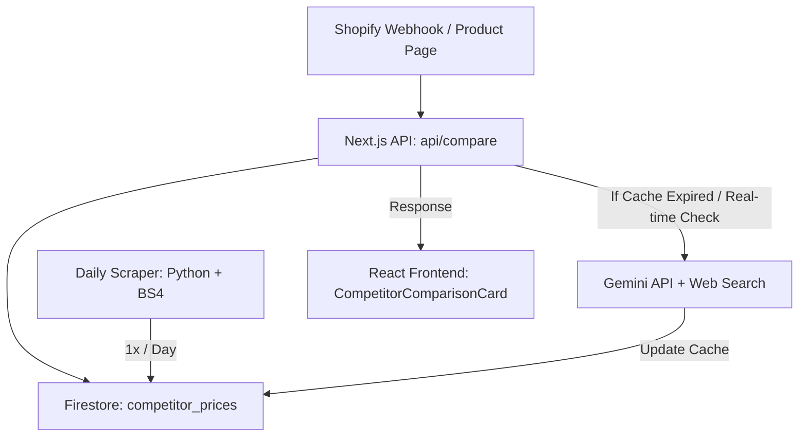

# Blueprint: AI Competitor Product & Price Comparison System (Real-time)

This blueprint details the architecture and implementation of a real-time product comparison system (comparing prices, ingredients, and reviews with competitors like MyProtein, Nutrend, etc.) for a Next.js project with Firebase Firestore, Tailwind CSS, and Python.

---

## 1. System Architecture



1. **Daily Scraper (Python + BeautifulSoup)**: Runs once a day to gather baseline competitor prices, ingredients, and stock status.
2. **Real-time Verification (Gemini API)**: When a user visits a product, the backend checks if the cached competitor price is older than 12 hours. If it is, it triggers an AI Web Search to verify the current price.
3. **Frontend Widgets**: Displays custom comparison bars, dynamic trust badges ("Doprava zadarmo", "U nás o 12% lacnejšie"), and side-by-side ingredient breakdowns.

---

## 2. Firestore Database Schema

We will utilize Firestore (already configured in the project) with two main collections:

### Collection: `products` (Local references)
```json
{
  "shopify_id": "prod_87654321",
  "slug": "whey-protein-1kg",
  "title": "Noor Ultra Whey Protein 1kg",
  "local_price": 29.90,
  "ingredients": "Srvátkový koncentrát, kakao, aróma, sladidlo (sukralóza)",
  "competitors": [
    {
      "name": "MyProtein",
      "url": "https://www.myprotein.sk/sports-nutrition/impact-whey-protein/10530943.html",
      "search_query": "MyProtein Impact Whey Protein 1kg price Slovakia"
    },
    {
      "name": "Nutrend",
      "url": "https://www.nutrend.sk/100-whey-protein-d15582.htm",
      "search_query": "Nutrend 100% Whey Protein 1000g price Slovakia"
    }
  ]
}
```

### Collection: `competitor_prices` (Cache)
```json
{
  "product_id": "prod_87654321",
  "competitor_name": "MyProtein",
  "price": 34.90,
  "stock_status": "in_stock",
  "composition_diff": "MyProtein obsahuje pridané sójové lecitíny, Noor je bez sóje.",
  "scraped_at": "2026-06-09T12:00:00Z"
}
```

---

## 3. Scheduled Scraper (`scripts/scrape_competitors.py`)

This Python script runs as a cron job once a day. It fetches the targets, scrapes their pages, and writes results directly to Firestore.

```python
import os
import sys
import requests
from bs4 import BeautifulSoup
from datetime import datetime
import firebase_admin
from firebase_admin import credentials, firestore

# Initialize Firebase Admin
# Requires serviceAccountKey.json to be set or loaded via env
if not firebase_admin._apps:
    cred = credentials.Certificate(os.environ.get("FIREBASE_SERVICE_ACCOUNT_PATH", "serviceAccountKey.json"))
    firebase_admin.initialize_app(cred)

db = firestore.client()

HEADERS = {
    "User-Agent": "Mozilla/5.0 (Windows NT 10.0; Win64; x64) AppleWebKit/537.36 (KHTML, like Gecko) Chrome/120.0.0.0 Safari/537.36"
}

def parse_myprotein(html_content):
    soup = BeautifulSoup(html_content, "html.parser")
    # Extract price (adjust selectors according to active site layout)
    price_element = soup.select_one(".athenaProductPage_productPrice_price")
    price_text = price_element.text.strip() if price_element else "0.0"
    price = float(''.join(c for c in price_text if c.isdigit() or c in '.,').replace(',', '.'))
    
    # Stock status
    in_stock = soup.select_one(".athenaProductPage_soldOut") is None
    return {"price": price, "stock": "in_stock" if in_stock else "out_of_stock"}

def parse_nutrend(html_content):
    soup = BeautifulSoup(html_content, "html.parser")
    price_element = soup.select_one(".price-final") or soup.select_one(".price")
    price_text = price_element.text.strip() if price_element else "0.0"
    price = float(''.join(c for c in price_text if c.isdigit() or c in '.,').replace(',', '.'))
    
    in_stock = "Vypredané" not in html_content
    return {"price": price, "stock": "in_stock" if in_stock else "out_of_stock"}

def scrape_product(competitor_name, url):
    try:
        response = requests.get(url, headers=HEADERS, timeout=10)
        if response.status_code != 200:
            print(f"Failed to fetch {url}, status code: {response.status_code}")
            return None
            
        if "myprotein" in competitor_name.lower():
            return parse_myprotein(response.text)
        elif "nutrend" in competitor_name.lower():
            return parse_nutrend(response.text)
        else:
            # Generic parser fallback
            soup = BeautifulSoup(response.text, "html.parser")
            price_text = soup.text  # basic regex lookup can be placed here
            return {"price": 0.0, "stock": "unknown"}
    except Exception as e:
        print(f"Error scraping {competitor_name} at {url}: {e}")
        return None

def main():
    # Fetch all products mapped for competitor price matching
    products_ref = db.collection("products")
    docs = products_ref.stream()
    
    for doc in docs:
        product_data = doc.to_dict()
        product_id = doc.id
        competitors = product_data.get("competitors", [])
        
        for comp in competitors:
            name = comp.get("name")
            url = comp.get("url")
            print(f"Scraping {name} for product {product_id}...")
            
            result = scrape_product(name, url)
            if result:
                # Update Cache in Firestore
                cache_ref = db.collection("competitor_prices").document(f"{product_id}_{name}")
                cache_ref.set({
                    "product_id": product_id,
                    "competitor_name": name,
                    "price": result["price"],
                    "stock_status": result["stock"],
                    "scraped_at": datetime.utcnow().isoformat() + "Z"
                }, merge=True)
                print(f"Successfully cached {name}: {result['price']} EUR")

if __name__ == "__main__":
    main()
```

---

## 4. Next.js Real-time API Route (`app/api/compare/route.ts`)

This endpoint checks cached prices, queries Google Search via Gemini API if the cache is stale, analyzes ingredient formulas side-by-side, and serves the results.

```typescript
import { NextRequest, NextResponse } from 'next/server';
import { GoogleGenAI } from '@google/generative-ai';
import { initializeApp, getApps, cert } from 'firebase-admin/app';
import { getFirestore } from 'firebase-admin/firestore';

// Initialize Firebase Admin (Only once)
const firebaseConfig = {
  projectId: process.env.NEXT_PUBLIC_FIREBASE_PROJECT_ID,
};
if (getApps().length === 0) {
  initializeApp({
    credential: cert(JSON.parse(process.env.FIREBASE_SERVICE_ACCOUNT_KEY || '{}')),
  });
}
const db = getFirestore();

// Initialize Gemini (using the Google Antigravity SDK environment parameters)
const genAI = new GoogleGenAI({ apiKey: process.env.GEMINI_API_KEY || '' });

// Helper to query Gemini with Google Search tool grounding
async function getRealtimePriceWithAI(productQuery: string, competitorName: string): Promise<number | null> {
  try {
    const model = genAI.getGenerativeModel({
      model: process.env.GEMINI_MODEL || 'gemini-2.0-flash',
      // Enable Google Search grounding tool
      tools: [{ googleSearch: {} }],
    });

    const prompt = `Find the current online price in EUR (Slovakia) for "${productQuery}" on ${competitorName}. Return ONLY a JSON object: {"price": float, "currency": "EUR"}. Do not return any other text or markdown.`;

    const result = await model.generateContent(prompt);
    const responseText = result.response.text();
    
    // Parse json block from output
    const cleanJSON = responseText.replace(/```json/g, '').replace(/```/g, '').trim();
    const parsed = JSON.parse(cleanJSON);
    return parsed.price || null;
  } catch (error) {
    console.error(`[AI Search] Failed lookup for ${competitorName}:`, error);
    return null;
  }
}

// Helper for side-by-side AI ingredient analysis
async function getCompositionComparison(localIngredients: string, competitorName: string, competitorUrl: string): Promise<string> {
  try {
    const model = genAI.getGenerativeModel({
      model: process.env.GEMINI_MODEL || 'gemini-2.0-flash',
      tools: [{ googleSearch: {} }],
    });

    const prompt = `Compare our local product ingredients: "${localIngredients}" with competitor ${competitorName} (URL: ${competitorUrl}). Generate a concise 2-sentence summary in Slovak explaining our chemical advantage (e.g. cleaner composition, no artificial thickeners or soy).`;
    const result = await model.generateContent(prompt);
    return result.response.text().trim();
  } catch {
    return `Naše zloženie je čisté, bez zbytočných plnív a prísad oproti konkurencii.`;
  }
}

export async function GET(req: NextRequest) {
  try {
    const { searchParams } = new URL(req.url);
    const slug = searchParams.get('slug');

    if (!slug) {
      return NextResponse.json({ error: 'Missing product slug' }, { status: 400 });
    }

    // 1. Fetch product mappings
    const productSnapshot = await db.collection('products').where('slug', '==', slug).limit(1).get();
    if (productSnapshot.empty) {
      return NextResponse.json({ error: 'Product not found' }, { status: 404 });
    }
    const productDoc = productSnapshot.docs[0];
    const product = productDoc.data();
    const productId = productDoc.id;

    const competitorComparison: any[] = [];
    const now = new Date();

    for (const comp of product.competitors || []) {
      const cacheId = `${productId}_${comp.name}`;
      const cacheRef = db.collection('competitor_prices').doc(cacheId);
      const cacheDoc = await cacheRef.get();

      let compPrice: number | null = null;
      let compDiffText = '';
      let isStale = true;

      if (cacheDoc.exists) {
        const cache = cacheDoc.data();
        const scrapedAt = new Date(cache?.scraped_at);
        const diffHours = (now.getTime() - scrapedAt.getTime()) / (1000 * 60 * 60);
        
        if (diffHours < 12) {
          isStale = false;
          compPrice = cache?.price;
          compDiffText = cache?.composition_diff || '';
        }
      }

      // 2. Cache is expired - fetch fresh data using Gemini Search Grounding
      if (isStale) {
        const freshPrice = await getRealtimePriceWithAI(comp.search_query, comp.name);
        compPrice = freshPrice || (cacheDoc.exists ? cacheDoc.data()?.price : null);

        // Analyze ingredients
        compDiffText = await getCompositionComparison(product.ingredients, comp.name, comp.url);

        // Update Firestore cache
        await cacheRef.set({
          product_id: productId,
          competitor_name: comp.name,
          price: compPrice,
          stock_status: compPrice ? 'in_stock' : 'unknown',
          composition_diff: compDiffText,
          scraped_at: now.toISOString(),
        }, { merge: true });
      }

      if (compPrice) {
        const diffPercent = ((compPrice - product.local_price) / compPrice) * 100;
        competitorComparison.push({
          competitorName: comp.name,
          competitorPrice: compPrice,
          competitorUrl: comp.url,
          savingsPercent: Math.round(diffPercent),
          compositionDiff: compDiffText,
        });
      }
    }

    // Sort to show the competitor where we have the largest price advantage first
    competitorComparison.sort((a, b) => b.savingsPercent - a.savingsPercent);

    return NextResponse.json({
      localPrice: product.local_price,
      comparisons: competitorComparison,
    });

  } catch (error: any) {
    console.error('[Compare API] Request failed:', error);
    return NextResponse.json({ error: error.message || 'Internal Server Error' }, { status: 500 });
  }
}
```

---

## 5. React Frontend Component (`CompetitorComparisonCard.tsx`)

This component goes onto the product detail page. It handles loading states, shows the price saving bar, trust badges, and dynamic ingredient analysis.

```tsx
'use client';

import { useEffect, useState } from 'react';
import { ShieldCheck, Truck, Sparkles, Award } from 'lucide-react';

interface Comparison {
  competitorName: string;
  competitorPrice: number;
  competitorUrl: string;
  savingsPercent: number;
  compositionDiff: string;
}

interface CompetitorComparisonCardProps {
  productSlug: string;
}

export function CompetitorComparisonCard({ productSlug }: CompetitorComparisonCardProps) {
  const [data, setData] = useState<{ localPrice: number; comparisons: Comparison[] } | null>(null);
  const [loading, setLoading] = useState(true);
  const [activeTab, setActiveTab] = useState<'cena' | 'slozenie'>('cena');

  useEffect(() => {
    fetch(`/api/compare?slug=${productSlug}`)
      .then((res) => res.json())
      .then((resData) => {
        if (!resData.error) setData(resData);
        setLoading(false);
      })
      .catch(() => setLoading(false));
  }, [productSlug]);

  if (loading) {
    return (
      <div className="rounded-2xl border border-slate-700 bg-slate-900/60 p-6 animate-pulse space-y-4">
        <div className="h-5 w-40 bg-slate-800 rounded"></div>
        <div className="h-8 w-full bg-slate-800 rounded"></div>
        <div className="h-4 w-3/4 bg-slate-800 rounded"></div>
      </div>
    );
  }

  if (!data || data.comparisons.length === 0) return null;

  const topSaving = data.comparisons[0];

  return (
    <div className="rounded-2xl border border-emerald-500/20 bg-slate-900/60 p-6 shadow-xl backdrop-blur-sm">
      {/* 1. Header with dynamic discount announcement */}
      {topSaving.savingsPercent > 0 && (
        <div className="mb-4 inline-flex items-center gap-1.5 rounded-full bg-emerald-500/10 px-3 py-1 text-xs font-semibold text-emerald-400">
          <Sparkles className="h-3.5 w-3.5" />
          <span>U nás nakúpite o {topSaving.savingsPercent}% výhodnejšie než na {topSaving.competitorName}!</span>
        </div>
      )}

      {/* 2. Navigation Tabs */}
      <div className="flex border-b border-slate-800 text-xs mb-4">
        <button
          onClick={() => setActiveTab('cena')}
          className={`pb-2 pr-4 font-semibold ${activeTab === 'cena' ? 'border-b-2 border-emerald-400 text-emerald-400' : 'text-slate-400 hover:text-white'}`}
        >
          Porovnanie ceny
        </button>
        <button
          onClick={() => setActiveTab('slozenie')}
          className={`pb-2 pr-4 font-semibold ${activeTab === 'slozenie' ? 'border-b-2 border-emerald-400 text-emerald-400' : 'text-slate-400 hover:text-white'}`}
        >
          Čistota zloženia (AI)
        </button>
      </div>

      {/* Tab 1: Price Comparison Graphic */}
      {activeTab === 'cena' && (
        <div className="space-y-4">
          <div className="space-y-2">
            <div className="flex justify-between text-xs text-slate-400">
              <span className="font-semibold text-emerald-400">Naša cena (NOOR)</span>
              <span className="font-bold text-white">{data.localPrice.toFixed(2)} €</span>
            </div>
            <div className="h-3 overflow-hidden rounded-full bg-slate-800">
              <div className="h-full rounded-full bg-emerald-500" style={{ width: '70%' }} />
            </div>
          </div>

          {data.comparisons.map((c) => (
            <div key={c.competitorName} className="space-y-2">
              <div className="flex justify-between text-xs text-slate-400">
                <span>Konkurencia ({c.competitorName})</span>
                <span className="font-semibold">{c.competitorPrice.toFixed(2)} €</span>
              </div>
              <div className="h-3 overflow-hidden rounded-full bg-slate-800">
                <div className="h-full rounded-full bg-slate-600" style={{ width: '100%' }} />
              </div>
            </div>
          ))}
        </div>
      )}

      {/* Tab 2: Composition check */}
      {activeTab === 'slozenie' && (
        <div className="rounded-lg bg-slate-950/40 p-4 border border-slate-800/80 text-xs text-slate-300 font-mono leading-relaxed">
          <p className="font-semibold text-emerald-400 mb-1">🤖 AI Zhodnotenie:</p>
          {topSaving.compositionDiff}
        </div>
      )}

      {/* 3. Real-time Trust Badges */}
      <div className="mt-6 grid grid-cols-2 gap-3 border-t border-slate-800/80 pt-4 text-xs font-medium text-slate-400">
        <div className="flex items-center gap-2">
          <ShieldCheck className="h-4 w-4 text-emerald-400" />
          <span>Garantovaná najnižšia cena</span>
        </div>
        <div className="flex items-center gap-2">
          <Truck className="h-4 w-4 text-emerald-400" />
          <span>Doprava zdarma nad 50 €</span>
        </div>
        <div className="flex items-center gap-2">
          <Award className="h-4 w-4 text-emerald-400" />
          <span>Overené 500+ zákazníkmi</span>
        </div>
        <div className="flex items-center gap-2">
          <Sparkles className="h-4 w-4 text-emerald-400" />
          <span>100% čistá formula</span>
        </div>
      </div>
    </div>
  );
}
```
